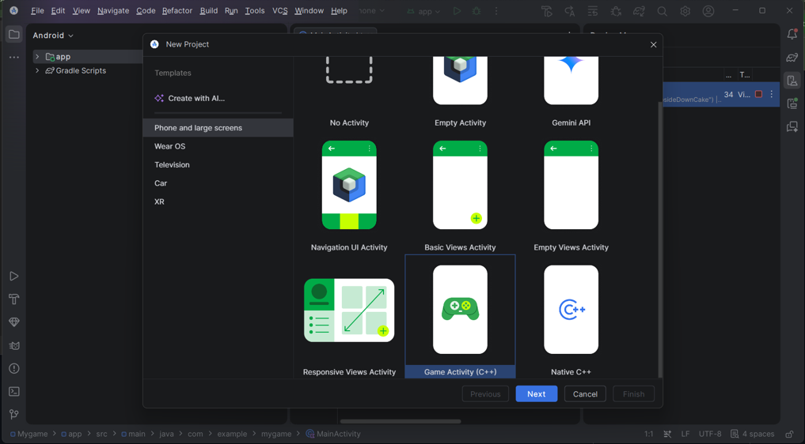
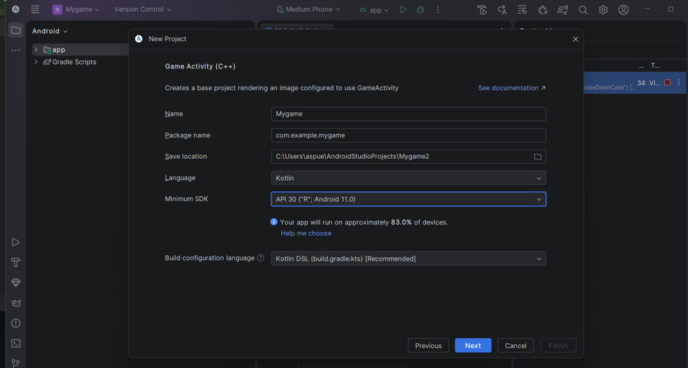
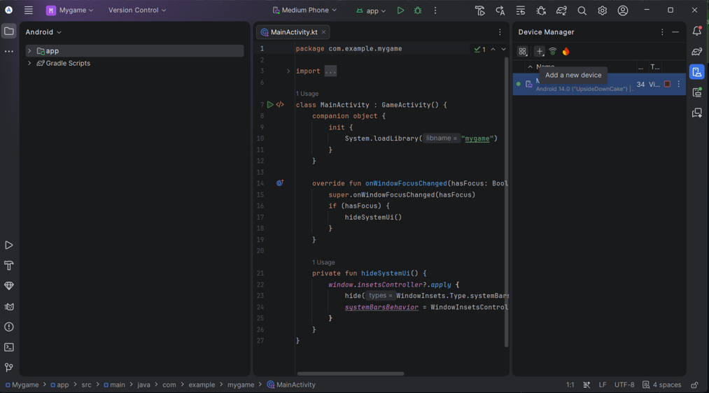
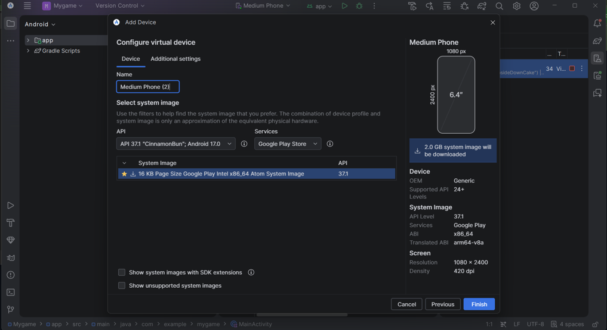
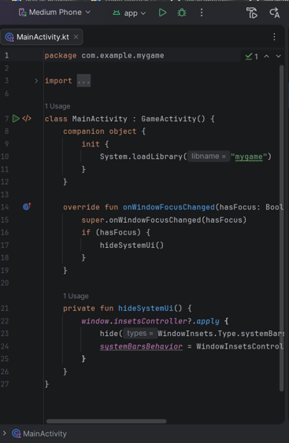
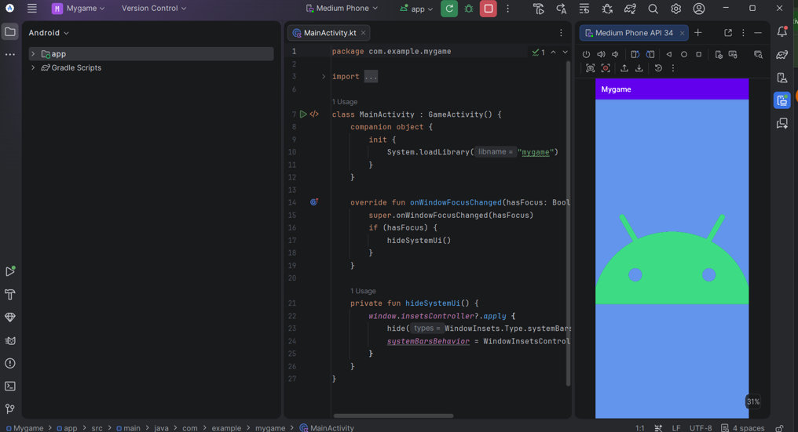

# Ejercio de Android Studio

Redacción y evidencia del paso a paso para completar
la activida de auto aprendizaje

## 1. Inicializar el IDE
Una vez instalamos el IDE junto a sus herramientas
abrimos nuestro programa y seleccionamos la opción
de "New project".

## 2. Crear proyecto nuevo
Al momento de abrir nuestro proyecto nuevo, el IDE
nos entrega un repertorio de plantillas disponibles,
en este caso usaremos "game activity"

## 3. Especificación de plantilla
Una vez seleccionada una plantilla el programa nos
permite elegir las configuraciones del proyecto, en
este caso lo nombre "Mygame", usare el lenguaje 
"Kotlin" y limitare el SDK mínimo a un "API 30-Android 11"
con el fin de el programa pueda ejecutarse en una mayor
cantidad de dispositivos

## 4. Creación del emulador
Ya creado el paquete del programa, buscamos la opción
device manager para poder agregar nuestro emulador.

Seleccionamos "Add a new device" y asi podemos nombrar y seleccionar el sistema que sera emulado, en este caso
dejamos el nombre genérico y seleccionamos un "API 37.1 -
Android 17.0" ya que este sistema podra correr nuestra aplicacion sin problema.

## 5. Ejecución del proyecto
Ya creado el emulador como podemos ver en el "Medium Phone"
y con la sincronización lista del proyecto para ser ejecutado
se genera el boton "play" verde, lo usamos para compilar
nuestra aplicación.

Una vez completados todos estos pasos, si el sistema del
dispositivo es compatible con el archivo y este se ejecuta correctamente, tendremos la aplicación corriendo en nuestro 
emulador.
